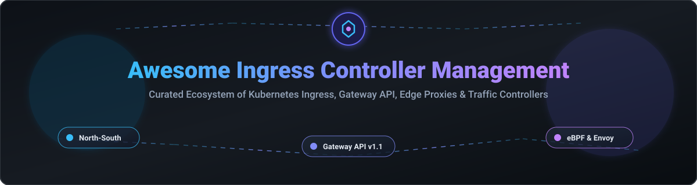

  

# 🚀 Awesome Ingress Controller Management 🌐

  
  
  
  
  

> **A curated, production-grade awesome list of SaaS enterprise management platforms, Gateway API implementations, Kubernetes Ingress controllers, edge proxies, and load balancers for cloud-native infrastructure.**

---

## ⚡ Quick Navigation

- [📊 Market Insights & Landscape](#-market-insights--landscape)
- [🏢 SaaS & Enterprise Platforms](#-saas--enterprise-platforms)
- [🔓 Open-Source GitHub Projects](#-open-source-github-projects)
- [🤝 How to Contribute](#-how-to-contribute)
- [⚠️ Disclaimer](#-disclaimer)
- [💖 Support & Buy Me a Coffee](#-support--buy-me-a-coffee-)
- [📈 Star History](#-star-history)

---

## 📊 Market Insights & Landscape 💡

> **Market Analysis & Fragmentation:** The global Kubernetes Ingress, Gateway API, and Application Delivery Controller (ADC) market is estimated at **$3.2 Billion (2026)** and is **moderately fragmented**. Established networking titans (F5, VMware/Broadcom) control enterprise ADC market share, while fast-growing cloud-native specialists (Kong, Solo.io, Isovalent/Cisco, Traefik Labs) capture market share with modern eBPF, Envoy, and Gateway API native control planes.

---

## 🏢 SaaS & Enterprise Platforms 💼

| SaaS / Enterprise Platform 🛠️ | Enterprise Pricing 💵 | Free Tier / Trial Limits ⏳ | Company Size & Scale (Valuation / Revenue) 📈 | Description 📝 |
| :--- | :--- | :--- | :--- | :--- |
| **[VMware Avi Load Balancer (Broadcom)](https://www.vmware.com/)** | $1,500/year per Service Engine instance | 60-day full-featured evaluation trial | **$800B+ Market Cap** (Broadcom parent) | Enterprise multi-cloud load balancer and Ingress/Gateway solution with centralized management and analytics. |
| **[NGINX Ingress Controller / F5 NGINX Plus](https://www.nginx.com/)** | $2,500/year per instance | 30-day free trial (Full enterprise features via MyF5 portal) | **$13B+ Market Cap** (F5 Inc. parent / ~$2B+ revenue) | Enterprise supported NGINX-based Kubernetes Ingress Controller with F5 NGINX Plus integration, active health checks, and SLA support. |
| **[Cilium Enterprise (Isovalent / Cisco)](https://cilium.io/)** | $3,000/year per cluster starting tier | 30-day evaluation enterprise license | **$200B+ Market Cap** (Acquired by Cisco in 2024 for ~$700M) | eBPF-powered networking, security, and Ingress/Gateway API platform with enterprise control plane and support. |
| **[Kong Gateway Enterprise / Konnect](https://konghq.com/)** | $250/month (Konnect Plus starting rate) / $30,000/year base | 30-day free trial (Kong Konnect Cloud platform) | **$2.0B Valuation** (~$100M+ ARR) | Cloud-native API gateway & Ingress platform offering multi-cluster control, enterprise plugins, and compliance options. |
| **[Gloo Edge / Gloo Gateway (Solo.io)](https://www.solo.io/)** | $12,000/year base platform subscription | 30-day free trial license | **$1.0B+ Unicorn Valuation** (~$35M+ ARR) | Envoy-based API gateway and Ingress platform with enterprise editions for advanced traffic routing, WAF, and service mesh integration. |
| **[Emissary-ingress (Ambassador Labs / Gravitee)](https://www.getambassador.io/)** | $500/month starting enterprise support contract | 14-day free trial of Ambassador Edge Stack | **$100M+ Valuation** (Acquired by Gravitee in 2025; $20M+ funding) | Kubernetes-native API gateway and Ingress solution built on Envoy Proxy with enterprise security and single sign-on. |
| **[Traefik Enterprise](https://traefik.io/)** | $2,000/year starting subscription | 30-day free trial (No credit card required) | **~$50M Valuation** (~$3.9M ARR) | Commercial edition of Traefik offering enhanced security, distributed rate limiting, multi-cluster management, and 24/7 support. |
| **[HAProxy Kubernetes Ingress Enterprise](https://www.haproxy.com/)** | $1,800/year per node | 30-day evaluation trial | **~$40M Valuation** (~$15M ARR) | High-performance enterprise Ingress Controller based on HAProxy Enterprise with WAF, DDoS protection, and premium modules. |
| **[Contour (Enterprise Support Options)](https://projectcontour.io/)** | $1,200/year support add-on via partners | Open-source core available with 30-day partner trials | **Ecosystem-Backed** (Maintained via VMware/Broadcom & CNCF) | Envoy-based high-performance Ingress Controller with enterprise commercial support packages. |

---

## 🔓 Open-Source GitHub Projects 🌟

| Project & Repository 📦 | GitHub_Stars ⭐ | Stargazers Link 🔗 | Description 📝 |
| :--- | :--- | :--- | :--- |
| **[Traefik](https://github.com/traefik/traefik)** |  | [traefik/stargazers](https://github.com/traefik/traefik/stargazers) | Popular open-source cloud-native application proxy and Ingress Controller with native Kubernetes, Docker, and Gateway API support. |
| **[Cilium](https://github.com/cilium/cilium)** |  | [cilium/stargazers](https://github.com/cilium/cilium/stargazers) | eBPF-based networking, security, and observability engine featuring high-performance Ingress Controller and Gateway API support. |
| **[ingress-nginx](https://github.com/kubernetes/ingress-nginx)** |  | [ingress-nginx/stargazers](https://github.com/kubernetes/ingress-nginx/stargazers) | The most widely deployed community open-source NGINX-based Ingress Controller maintained by the Kubernetes organization. |
| **[BFE (Baidu Front End)](https://github.com/bfenetworks/bfe)** |  | [bfe/stargazers](https://github.com/bfenetworks/bfe/stargazers) | Open-source layer-7 layer-4 enterprise edge proxy and ingress routing engine developed by Baidu. |
| **[NGINX Kubernetes Ingress Controller](https://github.com/nginx/kubernetes-ingress)** |  | [kubernetes-ingress/stargazers](https://github.com/nginx/kubernetes-ingress/stargazers) | Official open-source NGINX Ingress Controller (Apache 2.0) maintained directly by NGINX / F5. |
| **[Emissary-ingress](https://github.com/emissary-ingress/emissary)** |  | [emissary/stargazers](https://github.com/emissary-ingress/emissary/stargazers) | CNCF incubated open-source Kubernetes-native API gateway and Ingress controller built on Envoy Proxy. |
| **[Contour](https://github.com/projectcontour/contour)** |  | [contour/stargazers](https://github.com/projectcontour/contour/stargazers) | CNCF open-source Kubernetes Ingress Controller utilizing Envoy data plane with support for HTTPProxy and Gateway API. |
| **[Envoy Gateway](https://github.com/envoyproxy/gateway)** |  | [gateway/stargazers](https://github.com/envoyproxy/gateway/stargazers) | Official open-source Kubernetes Gateway API implementation using Envoy Proxy as the underlying data plane. |
| **[Kong Ingress Controller](https://github.com/Kong/kubernetes-ingress-controller)** |  | [kubernetes-ingress-controller/stargazers](https://github.com/Kong/kubernetes-ingress-controller/stargazers) | Open-source Ingress Controller configuring Kong Gateway for Kubernetes traffic routing and plugin management. |
| **[Apache APISIX Ingress Controller](https://github.com/apache/apisix-ingress-controller)** |  | [apisix-ingress-controller/stargazers](https://github.com/apache/apisix-ingress-controller/stargazers) | Apache Foundation high-performance open-source ingress controller for APISIX gateway. |
| **[HAProxy Ingress](https://github.com/haproxytech/kubernetes-ingress)** |  | [kubernetes-ingress/stargazers](https://github.com/haproxytech/kubernetes-ingress/stargazers) | High-performance open-source Kubernetes Ingress Controller built on HAProxy proxy engine. |
| **[Gloo Edge Control Plane](https://github.com/solo-io/gloo)** |  | [gloo/stargazers](https://github.com/solo-io/gloo/stargazers) | Open-source Envoy-based ingress controller and API gateway control plane components by Solo.io. |
| **[Flomesh Service Mesh (FSM)](https://github.com/flomesh-io/fsm)** |  | [fsm/stargazers](https://github.com/flomesh-io/fsm/stargazers) | Lightweight open-source Pipelined service mesh and ingress controller for Kubernetes & edge computing. |

---

## 🛠️ Key Selection Criteria for Platform Engineers 🧠

- **Gateway API Readiness:** Choose implementations like **Envoy Gateway**, **Cilium**, **Traefik**, or **Contour** for modern Kubernetes v1.30+ cluster networking.
- **NGINX Familiarity:** Use **ingress-nginx** or **nginx/kubernetes-ingress** when leveraging existing NGINX Lua modules or snippet annotations.
- **eBPF & Performance:** Adopt **Cilium Ingress** for kernel-level packet routing without kube-proxy overhead.
- **Enterprise Governance:** Upgrade to enterprise distributions (NGINX Plus, Kong Enterprise, Traefik Enterprise) when 24/7 SLAs, commercial WAF modules, or compliance mandates are required.

---

## 🤝 How to Contribute 🛠️

1. **Fork** the repository 🍴
2. Add your entry to `README.md` following the standard tabular format 📝
3. Verify product pricing, free trial limits, or GitHub star metrics 🔍
4. Submit a **Pull Request** with a descriptive summary 🚀

---

## ⚠️ Disclaimer 📜

- This list is **community-curated** for architectural reference and educational purposes.
- Ingress controllers operate on the critical path for production traffic; always perform independent security hardening, performance benchmark testing, and license auditing prior to deployment.

---

## 💖 Support & Buy Me a Coffee ☕

Thank you for visiting and supporting this project! If you find this curated list of Kubernetes Ingress and Gateway API tools helpful in your platform engineering work, please consider:

- ⭐ **Starring** this repository to help others discover it.
- 🍴 **Forking** it to customize or contribute new tools.
- 📢 **Sharing** it with fellow SREs, platform engineers, and cloud-native architects!

If you'd like to support ongoing maintenance and project curation, you can buy me a coffee via GitHub Sponsors:

---

## 📈 Star History 🌟

---

  Maintained with ❤️ by Platform Engineers and Cloud-Native Operators. Inspired by the <a href="https://github.com/ishandutta2007/Awesome-Awesome-Awesome">Awesome Community</a>.

